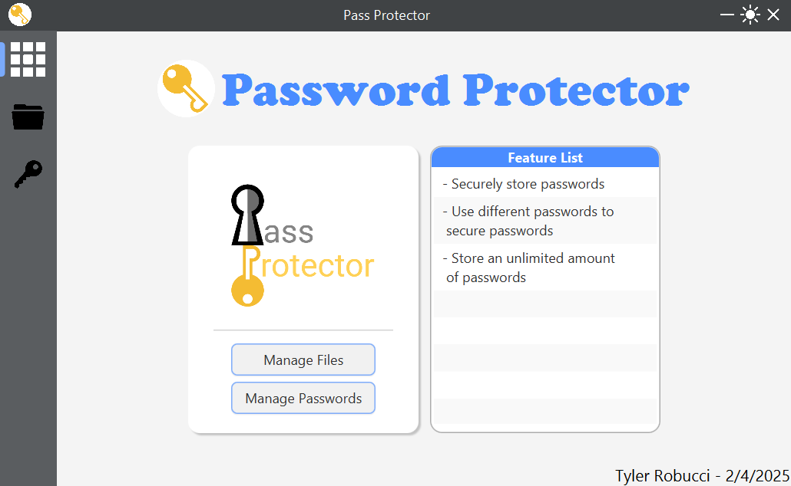
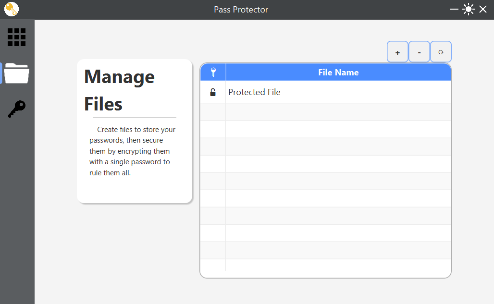
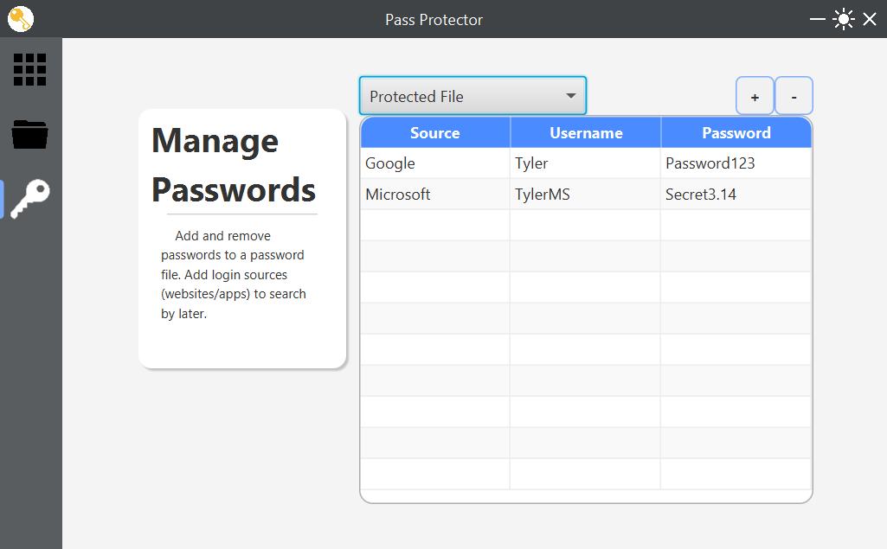

  

  
  
  
  
  

# Password Protector

&nbsp;&nbsp;&nbsp;&nbsp;An extra secure password manager for those worried about their passwords being stolen. 
Keeps passwords safely encrypted on device through a single password given by the user. Stores a hashed version of the password, 
salt, and initialization vector (IV) within a database for password verification. Sends back the salt and IV for decryption when the 
correct password is given for the particular encrypted file.

## 🖼️Preview

### Screenshots

  
  
  

### Video Demo

## 🛠️Tech Stack

**Framework:** JavaFX

**Database:** MongoDB

### Features:

- Store passwords locally
- Encrypt password files with a key
- File password verification with database

## 📥Installation

1. Download the project
2. Unzip/extract the project folder
3. Open in an IDE (IntelliJ, Eclipse)
4. Get a MongoDB URI
4. Set up environment variable
5. Run Main.java

#### Environment Variables

Add the following environment variables to your .env file from `MongoDB`

`MONGO_URI`
